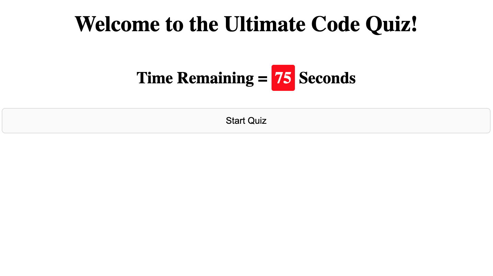

# Ultimate-Code-Quiz

UW Code Bootcamp Week 4 Homework

## Table of Contents

- [Developer Comment](#developer-comment)
- [Employer Request](#employer-request)
- [User Story](#user-story)
- [Acceptance Criteria](#acceptance-criteria)
- [Mockup](#mockup)
- [Website Features and Highlights](#website-features-and-highlights)
- [Live Project Site](#live-project-site)
- [Installation and Git Repository](#installation-and-git-repository)
- [Credits](#credits)

## Developer Comment

Hello everyone, and welcome back to my Repo! My name is Abdulhakeem Dahir and I am an aspiring Software Developer. This week I have been tasked to make the Ultimate Code Quiz. This is our second assignment! It was pretty difficult, but getting it done was worthwhile. Any feedback is welcome! Thank you!

## Employer Request

A UW Coding Bootcamp student wants to test their knowledge. They require a timed quiz application. I have to use my knowledge of Javascript to create this and to store their high score . Below is their User Story:

### User Story

```
AS A coding boot camp student
I WANT to take a timed quiz on JavaScript fundamentals that stores high scores
SO THAT I can gauge my progress compared to my peers
```

### Acceptance Criteria

```
GIVEN I am taking a code quiz
WHEN I click the start button
THEN a timer starts and I am presented with a question
WHEN I answer a question
THEN I am presented with another question
WHEN I answer a question incorrectly
THEN time is subtracted from the clock
WHEN all questions are answered or the timer reaches 0
THEN the game is over
WHEN the game is over
THEN I can save my initials and score
```

## Mockup

The following animation demonstrates the application functionality:


## Website Features and Highlights

The follwing are all of the feautres and highlights of my portfolio:

### HTML & CSS

```
- Created a responsive HTML shell for my code to run
```

### JAVASCRIPT

```
- Created time functionality for the code quiz with SetInterval
- Created and appended HTML elements via Javascript
- Modified and styled newly rendered items via Javascript
- Used Event Propogation and Delegation to listen to Click Events
- Stored User score and Initials via Local Storage

```

## Live Project Site

https://abdulhakeemdahir.github.io/Ultimate-Code-Quiz/



## Installation and Git Repository

Respository: https://github.com/abdulhakeemdahir/Ultimate-Code-Quiz

Please follow the installation process below:

```
1. Fork the repository from the link above
2. Clone the repo to your computer via git
3. Open the project files with the text editor of your choice.
```
